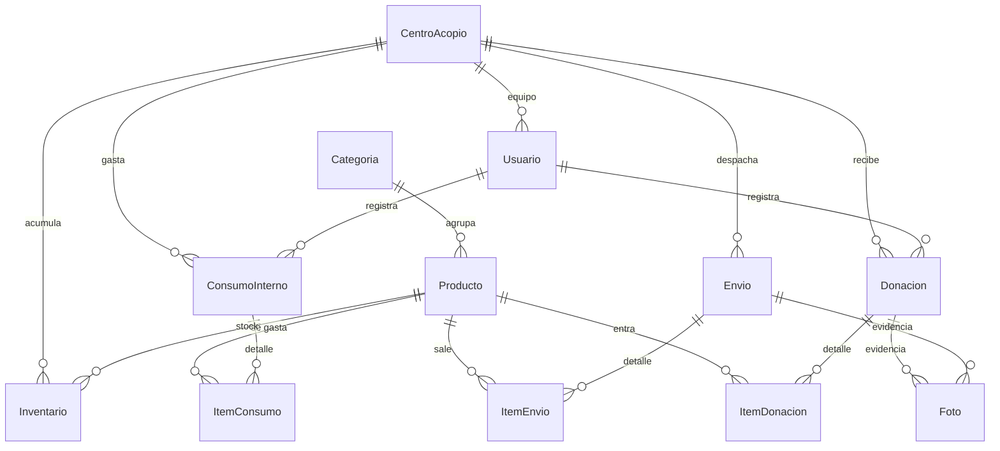

# Acopio Venezuela

**Software para gestionar centros de acopio humanitario.** Permite registrar las donaciones que
entran, controlar el inventario, organizar los envíos hacia Venezuela y publicar una página por
centro para que la gente sepa dónde y qué donar.

Está hecho para una red distribuida: varios centros de acopio en distintos países, cada uno con su
propio equipo e inventario, despachando cargas a un destino común — y con visibilidad global para
quien coordina toda la operación.

🌐 **Aplicación en producción:** https://acopiovnzla-production.up.railway.app

---

## Tabla de contenidos

**Para entender el proyecto**
- [¿Qué es?](#qué-es)
- [¿Por qué se construyó?](#por-qué-se-construyó)
- [Cómo usarlo](#cómo-usarlo)
- [Roles y permisos](#roles-y-permisos)

**Para desarrolladores**
- [Tecnologías](#tecnologías)
- [Organización del código](#organización-del-código)
- [Modelo de datos](#modelo-de-datos)
- [Instalación local](#instalación-local)
- [Variables de entorno](#variables-de-entorno)
- [Comandos](#comandos)
- [API](#api)
- [Despliegue](#despliegue)
- [Seguridad](#seguridad)
- [Contribuir](#contribuir)

---

## ¿Qué es?

Un **centro de acopio** recibe donaciones en especie (comida, medicinas, higiene, ropa), las
almacena y las despacha hacia donde se necesitan. Esta aplicación cubre ese ciclo completo y lo
deja auditable.

```
                    ┌─────────────────────┐
   DONACIONES ─────▶│                     │─────▶ ENVÍOS a Venezuela
   (lo que entra)   │  INVENTARIO         │       (descuenta del inventario)
                    │  del centro         │
                    └─────────────────────┘
                              │
                    CONSUMO INTERNO (ledger aparte,
                    lo que gasta el propio equipo)
```

Tres ideas gobiernan el diseño:

1. **El inventario no se edita a mano.** Es el resultado de los movimientos: cada donación suma,
   cada envío resta. Así siempre cuadra con lo registrado y nadie puede "ajustar" un número.
2. **El consumo interno es un ledger separado y NO descuenta del inventario destinado a
   Venezuela.** Lo que el equipo gasta operando (agua para los voluntarios, botiquín, cinta
   adhesiva) se registra aparte, a propósito: mezclarlo con lo donado haría imposible rendir
   cuentas de a dónde fue cada cosa.
3. **Lo público es público.** Cada centro tiene una página abierta con su ubicación, sus contactos
   y qué está recibiendo. El donante no necesita cuenta ni pedirle permiso a nadie para saber
   dónde llevar sus cosas.

---

## ¿Por qué se construyó?

Un centro de acopio arranca con una libreta o un Excel. Eso aguanta hasta que llegan tres cosas
juntas:

- **Volumen.** Cientos de donaciones por semana. Nadie va a transcribir eso a mano dos veces.
- **Muchas manos.** Voluntarios distintos, en turnos distintos, anotando lo mismo de formas
  distintas: "arroz 20kg", "20 kilos de arroz", "1 saco arroz". Al final de la semana no hay forma
  de sumar.
- **Rendición de cuentas.** Quien dona pregunta qué pasó con lo suyo. Quien recibe en destino
  necesita un manifiesto. Y hay que poder responder: cuánto entró, cuánto salió, qué queda, quién
  lo registró y cuándo.

Cada decisión del producto sale de un problema concreto del terreno:

| Problema real | Qué se construyó |
|---|---|
| El voluntario registra de pie, en la puerta del centro, con una mano ocupada | Formulario **optimizado para móvil** y **dictado por voz**: se habla la donación y se convierte en ítems del catálogo |
| Los centros ya venían llevando meses de datos en Excel | **Importador de CSV** con asistente de mapeo de columnas, para no perder el historial |
| Cada uno escribe el mismo producto de diez maneras | **Catálogo cerrado** de categorías y productos, con unidad de medida y peso por envase |
| Unos anotan kilos, otros sacos, otros unidades | Conversión de unidades (g/kg/ml/L) a la unidad base del producto |
| El transportista necesita un papel firmable | **Guía de despacho en PDF**, generada con la impresión del navegador |
| El coordinador general está en otro país que el centro | Roles con alcance **por centro, por país o global** |
| El donante no sabe dónde llevar las cosas | **Página pública** por centro + mapa en la portada |
| Un centro nuevo quiere sumarse sin esperar a que alguien lo dé de alta | **Auto-registro** de centros y de voluntarios |

> **Nota para quien mantenga esto:** esta sección describe el *porqué* funcional, deducido del
> código y del producto. Si quieres añadir el contexto humano — quién lo impulsó, cuándo, en qué
> emergencia y qué centros lo usan hoy — este es el lugar.

---

## Cómo usarlo

### 1. Soy donante y quiero ayudar

No necesitas cuenta.

1. Entra a la portada. Verás el **mapa de centros activos** y los contadores de la operación.
2. Toca el centro más cercano para abrir su **página pública**: dirección, ciudad, país, teléfono,
   WhatsApp y qué está recibiendo.
3. Lleva tu donación. Quien te reciba la registra en el sistema en el momento.

La página `/como-funciona` explica el recorrido completo, con mockups de cada pantalla.

### 2. Mi organización quiere abrir un centro

1. Entra a `/registrar-centro` y completa el formulario: nombre, ciudad, país, ubicación en el
   mapa y datos de contacto.
2. En el mismo paso se crea tu usuario **Responsable** con su contraseña.
3. Entra en `/login` y ya tienes tu centro con su página pública y su inventario en cero.

Los voluntarios se registran solos en `/registrar-voluntario` y eligen su centro. Quedan
registrados como parte del equipo, pero **no inician sesión** — para eso hacen falta permisos de
Coordinador o superiores.

### 3. Registrar una donación (lo que se hace todos los días)

Ve a **Donaciones → Registrar donación**. Tres formas de hacerlo:

**a) A mano.** Eliges los productos del catálogo con el buscador y pones la cantidad. Puedes
registrar el peso, las unidades, o ambos — si solo pones el peso, las unidades quedan en 1
automáticamente. Los datos del donante son **opcionales**: si no los pide o no los da, queda como
donante anónimo. Puedes adjuntar fotos.

**b) Hablando.** Toca el botón de voz y di la donación completa de corrido: *"veinte kilos de
arroz, cinco litros de aceite, tres paquetes de pañales"*. El sistema la parte en ítems y los
asocia al catálogo para que los confirmes. Funciona en el navegador, sin servicio externo.

**c) Importando un CSV.** Para cargar lo que ya tienes en Excel. Asistente de tres pasos:

| Paso | Qué haces |
|---|---|
| 1. Subir | Cargas el archivo `.csv` |
| 2. Asociar columnas | Dices qué columna es el producto, cuál la cantidad, cuál el donante, etc. |
| 3. Revisar e importar | Verificas fila por fila, corriges los productos mal asociados y confirmas |

El emparejado de nombres es determinístico y no requiere nada externo. Si activaste la
[IA opcional](#ia-opcional), hay un botón extra para que un modelo asocie los nombres más raros.

**Cada donación registrada suma al inventario del centro automáticamente.**

### 4. Despachar un envío

**Envíos → Registrar envío.** Cargas el destino y el receptor, eliges del inventario lo que va en
esa carga, y llenas los datos logísticos: transportista, tipo de transporte, número de guía, placa
o contenedor, conductor y su contacto, peso total, número de bultos y fechas (envío, estimada de
llegada, entrega). Puedes adjuntar evidencia fotográfica.

El envío pasa por tres estados: **`PREPARANDO` → `EN_TRANSITO` → `ENTREGADO`**.

Al crearlo, **lo despachado se descuenta del inventario**. Con el botón **Descargar PDF** obtienes
la guía de envío imprimible para entregarle al transportista.

### 5. Registrar el consumo interno

**Consumo Interno → Registrar Consumo.** Es lo que gasta el propio centro para poder operar,
clasificado por motivo: hidratación del equipo, alimentación del equipo, botiquín de voluntarios,
materiales de operación u otro.

Va a un **ledger independiente que no toca el inventario** destinado a Venezuela. Solo el
Responsable del centro puede registrarlo.

### 6. Ver cómo va todo y sacar reportes

**Dashboard** — evolución en el tiempo y desglose por categoría. Si eres Responsable o
Coordinador ves tu centro; si eres Administrador o Super Admin, todos.

**Exportar CSV** — desde Donaciones, el botón de exportar respeta los filtros que tengas puestos
(centro, ciudad, fechas). Genera una fila por producto donado, con todos los campos e IDs, listo
para cruzar en Excel.

### 7. Administrar la red (Super Admin / Administrador)

**Portal de administración** — alta y edición de centros, subir el banner de cada uno, crear
usuarios, asignar roles y restablecer contraseñas.

**Catálogo** (solo Super Admin) — categorías y productos: unidad de medida, valor unitario y peso
por envase. Es la pieza que mantiene los datos comparables entre centros, así que conviene tocarla
con cuidado. El sistema arranca con **12 categorías y 320 productos** de uso habitual.

**Mi Centro** (Responsable / Coordinador) — datos del centro y su equipo de voluntarios.

> ⚠️ El Super Admin **no puede cambiar su propia contraseña desde la app** (sí la de los demás).
> La suya se fija con el seed o directamente en la base de datos.

---

## Roles y permisos

Definidos en [`src/lib/permisos.ts`](src/lib/permisos.ts). La etiqueta que ve el usuario no siempre
coincide con el nombre del rol en la base de datos:

| Rol (BD) | Etiqueta en la UI | Alcance |
|---|---|---|
| `SUPERADMIN` | Super Admin | Todo. El único con acceso al catálogo y a gestionar administradores de país |
| `ADMIN_PAIS` | Administrador | Ve todo, pero crea y edita centros y usuarios **solo de sus países** |
| `ADMIN` | Responsable | Su centro completo: dashboard, donaciones, consumo interno, envíos, mi centro |
| `COORDINADOR` | Coordinador | Dashboard y donaciones de su centro; puede ver y crear voluntarios |
| `VOLUNTARIO` | Voluntario | Sin acceso al sistema (solo queda registrado en el equipo) |
| `SOLO_LECTURA` | Solo Lectura | Consulta |

Cada rol solo puede crear roles por debajo del suyo (`rolesQuePuedeCrear`).

---

## Tecnologías

| Capa | Tecnología | Por qué |
|---|---|---|
| Framework | **Next.js 16** (App Router, Turbopack) + **React 19** | Un solo proyecto para las páginas públicas, el panel privado y la API |
| Base de datos | **PostgreSQL** con **Prisma 5** | Los movimientos de inventario necesitan transacciones reales; Prisma da el esquema tipado |
| Autenticación | **NextAuth v4** — credenciales + sesión JWT | Login por email y contraseña, sin depender de un proveedor externo. Hash **bcrypt, 12 rondas** |
| Estilos | **Tailwind CSS v4** + primitivas de **Radix UI** | Accesibilidad de los componentes interactivos sin arrastrar una librería de UI completa |
| Imágenes | **Cloudinary** (`next-cloudinary`) | Fotos de donaciones y banners, con transformaciones y CDN |
| Gráficos | **recharts** | Series y donuts del dashboard |
| Mapas | **react-leaflet** / Leaflet | Mapa público de centros y selector de ubicación al registrar uno |
| Voz | **Web Speech API** del navegador | Dictado de donaciones sin costo ni servicio de terceros |
| PDF | Impresión nativa del navegador | La guía de envío no justifica una dependencia de PDF |
| Hosting | **Railway** (app + Postgres) | Deploy automático desde GitHub |
| IA (opcional) | **NVIDIA NIM** (Llama 3.1) | Solo para asociar nombres de productos al importar CSV. Ver [IA opcional](#ia-opcional) |

> ⚠️ **Next.js 16 rompe cosas** respecto a 14/15. Lo que más sorprende en este repo:
> - El middleware se llama **`src/proxy.ts`**, no `middleware.ts`.
> - Los `params` de las rutas son **promesas**: `{ params }: { params: Promise<{ id: string }> }`,
>   y hay que hacerles `await`.
>
> Antes de escribir código, revisa la guía correspondiente en `node_modules/next/dist/docs/`.

---

## Organización del código

```
prisma/
  schema.prisma          Modelo de datos (fuente de verdad del esquema)
  seed.ts                Categorías + productos + superadmin (idempotente)
src/
  app/
    (protected)/         Páginas que exigen sesión
      dashboard/         Métricas y gráficos
      donaciones/        Registro, listado, filtros, export CSV, import CSV
      envios/            Despachos + guía PDF
      consumos/          Consumo interno del centro
      mi-centro/         Datos del centro y su equipo
      centros/           Listado global de centros
      admin/             Portal de administración (centros, usuarios, roles)
      catalogo/          Categorías y productos (solo superadmin)
    centro/[id]/         Página PÚBLICA de cada centro
    login/  registrar-centro/  registrar-voluntario/  como-funciona/  terminos/
    api/                 Endpoints REST (ver sección API)
  components/            UI reutilizable (+ components/ui: primitivas)
  lib/
    auth.ts              Configuración de NextAuth
    session.ts           Helpers de sesión, respuestas 401/403, scoping por centro
    permisos.ts          Permisos por rol (única fuente de verdad)
    prisma.ts            Singleton del cliente Prisma
    donaciones-filtros.ts  WHERE de donaciones, compartido entre listado y export
    paises.ts  utils.ts
  proxy.ts               Protección de rutas (el "middleware" de Next 16)
  types/next-auth.d.ts   Extiende la sesión con rol, centro y paisesAdmin
```

Dos convenciones que hay que conocer antes de tocar código:

1. **La autorización vive en cada handler de API, no en `proxy.ts`.** El proxy solo comprueba que
   exista cookie de sesión y redirige a `/login`. Quién puede hacer qué se decide dentro de cada
   endpoint con los helpers de `lib/session.ts` y `lib/permisos.ts`.
2. **Las escrituras se scopean por rol** con `resolveCentroDestino` (`lib/session.ts`): un rol no
   global queda forzado a *su* centro, aunque el cliente mande otro `centroAcopioId`.

---

## Modelo de datos



Claves para leerlo:

- **`Inventario`** es una tabla derivada, con `@@unique([centroAcopioId, productoId])`: una fila por
  centro y producto. La mueven las donaciones (suman) y los envíos (restan). Los consumos internos
  **no** la tocan.
- **`Producto`** define la unidad base (`KG`, `LITROS`, `UNIDADES`, `CAJAS`, `PAQUETES`) y,
  opcionalmente, `tamanoDefault` — el peso por envase, que permite registrar "3 sacos" y obtener
  los kilos.
- **`Usuario.passwordHash` es opcional**: los voluntarios quedan registrados pero no inician
  sesión (`auth.ts` rechaza a quien no tenga hash).
- **`Usuario.paisesAdmin`** es la lista de países que administra un `ADMIN_PAIS`.

---

## Instalación local

**Requisitos:** Node.js 20+, PostgreSQL 14+ (local o remoto) y, si vas a subir fotos, una cuenta
de Cloudinary.

```bash
# 1. Clonar e instalar
git clone https://github.com/juliomayaudon/AcopioVnzla.git
cd AcopioVnzla
npm install

# 2. Configurar el entorno
cp .env.example .env
#    → edita .env con tu DATABASE_URL y genera el secreto:
#      openssl rand -base64 32

# 3. Crear las tablas (este proyecto usa db push, NO migrations)
npx prisma db push

# 4. Cargar catálogo + superadmin
SEED_SUPERADMIN_EMAIL=tu@email.com SEED_SUPERADMIN_PASSWORD='una-clave-fuerte' npx tsx prisma/seed.ts

# 5. Arrancar
npm run dev
```

Abre http://localhost:3000 y entra en `/login` con el email y la clave del paso 4.

<details>
<summary>En PowerShell (Windows) las variables van así</summary>

```powershell
$env:SEED_SUPERADMIN_EMAIL="tu@email.com"; $env:SEED_SUPERADMIN_PASSWORD="una-clave-fuerte"; npx tsx prisma/seed.ts
```
</details>

El seed es **idempotente**: puedes volver a correrlo para recargar el catálogo sin perder datos ni
cambiarle la contraseña a un superadmin que ya exista.

Para datos de prueba (centros, donaciones y envíos de ejemplo) añade `SEED_DEMO=true`.
**Nunca en producción.**

---

## Variables de entorno

Plantilla completa en [`.env.example`](.env.example). `.env` está en `.gitignore` y **no debe
commitearse jamás**.

| Variable | Requerida | Para qué |
|---|:---:|---|
| `DATABASE_URL` | ✅ | Cadena de conexión a PostgreSQL |
| `NEXTAUTH_SECRET` | ✅ | Firma de los JWT de sesión (`openssl rand -base64 32`) |
| `NEXTAUTH_URL` | ✅ | URL pública de la app (en producción, la HTTPS real) |
| `CLOUDINARY_CLOUD_NAME` | ⬜ | Fotos y banners |
| `CLOUDINARY_API_KEY` | ⬜ | Fotos y banners |
| `CLOUDINARY_API_SECRET` | ⬜ | Fotos y banners |
| `NEXT_PUBLIC_CLOUDINARY_CLOUD_NAME` | ⬜ | Igual que el anterior, expuesto al navegador |
| `NVIDIA_API_KEY` | ⬜ | Botón opcional de IA al importar CSV |
| `NVIDIA_TEXT_MODEL` | ⬜ | Modelo a usar (por defecto `meta/llama-3.1-8b-instruct`) |
| `SEED_SUPERADMIN_EMAIL` | ⬜ | Email del superadmin que crea el seed |
| `SEED_SUPERADMIN_PASSWORD` | ⬜ | Su contraseña — **defínela**, o el seed usa una por defecto y avisa |
| `SEED_DEMO` | ⬜ | `true` para cargar datos de ejemplo (solo desarrollo) |
| `PORT` | ⬜ | Puerto (Railway usa `8080`) |

### IA opcional

El botón *"Asociar productos con IA"* del importador de CSV llama a
[`/api/productos/match`](src/app/api/productos/match/route.ts), que usa un modelo de texto de
NVIDIA (API key gratuita en [build.nvidia.com](https://build.nvidia.com)).

**Es estrictamente opcional.** Sin `NVIDIA_API_KEY` el botón avisa y el resto de la importación
funciona igual, porque el emparejado por defecto es determinístico. Ninguna otra parte del sistema
depende de un modelo de IA.

---

## Comandos

| Comando | Qué hace |
|---|---|
| `npm run dev` | Servidor de desarrollo (Turbopack) |
| `npm run build` | Build de producción (corre `prisma generate` antes) |
| `npm start` | Sirve el build |
| `npm run lint` | ESLint |
| `npx prisma db push` | Sincroniza el esquema con la BD — **este proyecto no usa migrations** |
| `npm run db:studio` | Prisma Studio, para inspeccionar la BD |
| `npx tsx prisma/seed.ts` | Carga categorías, productos y superadmin |

---

## API

Los endpoints están en `src/app/api/`. Los **públicos** no requieren sesión; el resto responde
`401` sin sesión y `403` si el rol no alcanza.

### Públicos

| Endpoint | Uso |
|---|---|
| `GET /api/stats` | Contadores globales de la portada |
| `GET /api/public/centros` | Centros activos para el mapa público |
| `GET /api/geocode` | Geocodificación de direcciones (selector de ubicación) |
| `POST /api/registro/centro` | Auto-registro de un centro |
| `POST /api/registro/voluntario` | Auto-registro de un voluntario |
| `/api/auth/[...nextauth]` | Login y logout (NextAuth) |

### Con sesión

| Endpoint | Uso |
|---|---|
| `GET·POST /api/donaciones` | Listado con filtros y paginación · registro |
| `GET /api/donaciones/export` | CSV de donaciones respetando los filtros activos |
| `POST /api/donaciones/import` | Importación en lote desde CSV + actualización de inventario |
| `GET·POST /api/envios` | Envíos y su detalle (el alta descuenta del inventario) |
| `GET·POST /api/consumos` | Consumo interno (ledger aparte) |
| `GET /api/dashboard` | Series y agregados del dashboard |
| `GET·POST /api/centros` · `GET·PATCH·DELETE /api/centros/[id]` | Gestión de centros |
| `POST /api/centros/[id]/banner` | Banner del centro (Cloudinary) |
| `GET·POST /api/usuarios` · `PATCH /api/usuarios/[id]` | Gestión de usuarios |
| `POST /api/usuarios/[id]/password` | Restablecer la contraseña de otro usuario |
| `GET·POST /api/productos` · `/api/categorias` | Catálogo |
| `POST /api/productos/match` | Emparejado de nombres con IA (opcional) |
| `POST /api/fotos` | Subida de fotos (solo imágenes, ≤8 MB) |

---

## Despliegue

El repo está conectado a **Railway**: cada push a `master` redespliega solo (~2 min). Dos
servicios: la app y un PostgreSQL.

Variables del servicio de la app:

```
DATABASE_URL   = ${{ Postgres.DATABASE_URL }}   # variable de referencia, no la pegues a mano
NEXTAUTH_URL   = https://<tu-dominio>
NEXTAUTH_SECRET= <secreto fuerte>
PORT           = 8080
CLOUDINARY_*   = <tus credenciales>
```

**Cambios de esquema.** No hay migrations, así que el `db push` se corre a mano contra la base de
producción usando la `DATABASE_PUBLIC_URL` del servicio Postgres (la interna no es alcanzable desde
tu máquina):

```powershell
# 1. edita prisma/schema.prisma
$env:DATABASE_URL="<DATABASE_PUBLIC_URL>"; npx prisma db push
# 2. commitea y pushea el schema
```

Corre el `db push` **antes o junto** con el deploy: si el código nuevo espera una columna que
todavía no existe, la app falla en producción hasta que la crees.

---

## Seguridad

Aplicado:

- Contraseñas con **bcrypt, 12 rondas**. El hash nunca sale por la API.
- **Autorización por rol en cada handler**, no solo en el proxy de rutas.
- **Sin IDOR**: los endpoints verifican que el recurso pertenezca al centro o país del solicitante
  antes de leerlo o modificarlo.
- **Whitelist de campos** en las escrituras (evita mass-assignment).
- Los **voluntarios no pueden iniciar sesión** (no tienen `passwordHash`).
- Subida de fotos limitada a imágenes de **≤8 MB**.
- `.env` fuera del repo; los secretos viven en Railway.

Limitaciones conocidas, por si vas a desplegarlo:

- **No hay rate limiting en el login.** Conviene ponerlo en la capa de red (Cloudflare o similar).
- El Super Admin **no puede cambiar su propia contraseña desde la app**: se fija con el seed o
  directo en la base de datos. Sí puede restablecer la de los demás.
- El esquema se sincroniza con `db push`, sin historial de migrations: un cambio destructivo no
  tiene vuelta atrás automática. Respalda antes de tocar producción.

Si encuentras una vulnerabilidad, repórtala en privado al mantenedor antes de abrir un issue
público.

---

## Contribuir

1. Haz un fork y crea una rama descriptiva.
2. `npm run lint` y `npm run build` deben pasar antes de abrir el PR.
3. Los commits de este repo van **en español, en imperativo y describiendo el efecto para el
   usuario** — por ejemplo: *"Donaciones: dictado por voz para registrar productos hablando"*.
   Sigue ese estilo.
4. Si tocas `prisma/schema.prisma`, di en el PR qué `db push` hace falta.

Antes de escribir código, lee [`AGENTS.md`](AGENTS.md): resume las convenciones del proyecto y las
trampas de Next.js 16.
